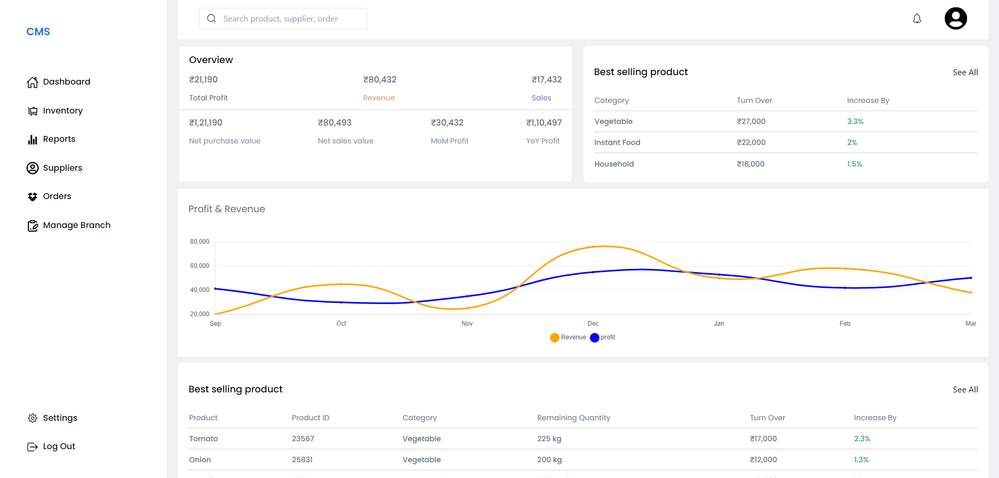
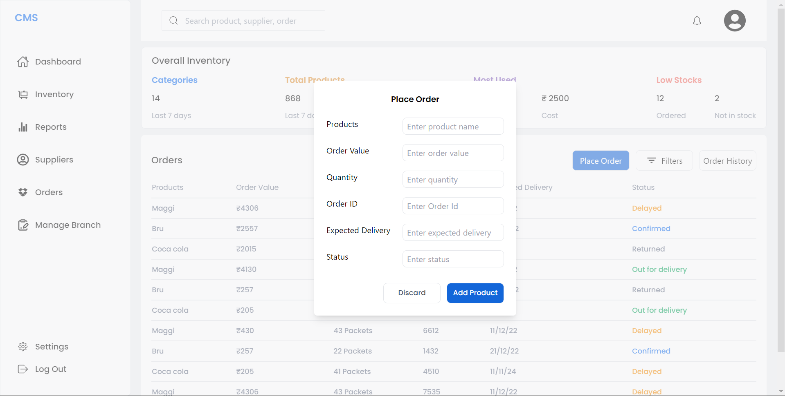
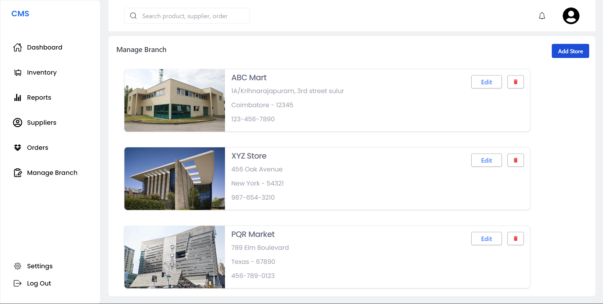

# CMS (consumables management system)

## Overview

This is a Product Management System, designed to efficiently handle products and their details. Whether you're managing a small inventory or a large catalog, this CMS provides the tools you need to organize, update, and analyze your product data.

## Features

- **Product CRUD Operations**: Create, read, update, and delete products easily.
- **Detailed Product Information**: Store and manage various details about each product, including name, description, price, availability, etc.
- **Category Management**: Categorize products to streamline navigation and organization.
- **User Authentication and Authorization**: Secure access to the CMS with user authentication and role-based authorization.
- **Search and Filtering**: Quickly find products using search and filter functionalities.
- **Analytics**: Track product performance, sales data, and other relevant metrics.
- **Customization**: Easily customizable to fit specific business needs and branding requirements.
- **Responsive Design**: User-friendly interface that works seamlessly across devices and screen sizes.

## Screenshorts

## Technologies Used

- **Backend**: Node.js, Express.js, MongoDB
- **Frontend**: HTML, CSS, JavaScript (React.js)
- **Authentication**: JSON Web Tokens (JWT)
- **Database**: MongoDB (NoSQL)

## Setup Instructions

1. Clone the repository: `git clone https://github.com/SARIF-MALIK/Adore.git`
2. Navigate to the project directory: `cd Adore`
3. Install dependencies: `npm install`
4. Set up environment variables:
   - Create a `.env` file in the root directory.
5. Start the server: `npm run dev`
6. Access the CMS in your browser at `http://localhost:3000`

## Usage

1. **Login**: Sign in to the CMS using your credentials.
2. **Dashboard**: View an overview of your products and sales data.
3. **Product Management**: Add, edit, or delete products as needed.
4. **Category Management**: Organize products into categories for better organization.
5. **Analytics**: Monitor product performance and sales metrics.
6. **Logout**: Securely log out of the CMS when done.

## Contributing

Contributions are welcome! Feel free to submit bug reports, feature requests, or pull requests to help improve this project.

## License

This project is licensed under the MIT License. See the [LICENSE](LICENSE) file for details.

## Contact

For any inquiries or support, please contact [Sarif Malik](mailto:sarif.malik@hotmail.com).
